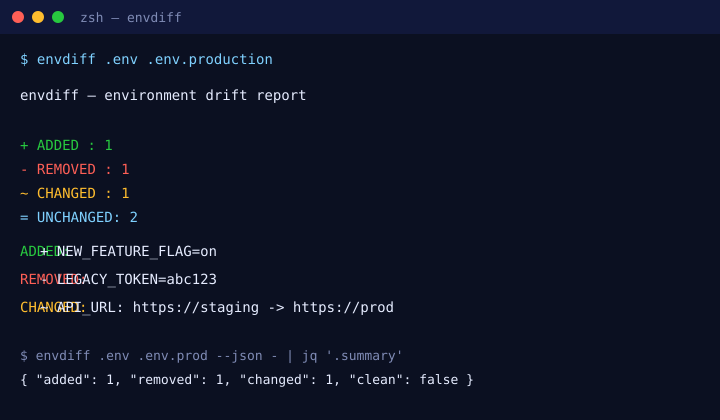

# envdiff

**Detect environment-variable drift between two sources in one command — zero config, fully local.**

> "Works on my machine." — every drift bug ever. `envdiff` catches the difference before it ships.

[](LICENSE)
[](https://www.python.org)
[](https://github.com/Prasanth-000/envdiff/actions)
[](https://github.com/Prasanth-000/envdiff)
[](https://github.com/Prasanth-000/envdiff/releases)

---

## Why

`.env` files drift. Between your laptop, CI, staging, and a teammate's machine,
environment variables get added, removed, or silently changed. `diff` won't help —
it chokes on key ordering, comments, and quoted values. `envdiff` is built for
exactly this: a single command that tells you **ADDED / REMOVED / CHANGED /
UNCHANGED** keys, in a clean terminal table or a machine-readable JSON report.

- ✅ Zero dependencies on external services — everything runs locally.
- ✅ Understands `.env` syntax: comments, quotes, `KEY=VALUE`, last-wins.
- ✅ Three source modes: `file:file`, `file:shell`, `dir:dir`.
- ✅ JSON / Markdown report output for CI and docs.
- ✅ Path-confined output — reports can only land in home / tmp / cwd / XDG-data.

## Install

```bash
pipx install envdiff
# or
pip install envdiff
```

## Quickstart

```bash
# 1. Compare two .env files
envdiff .env .env.production

# 2. Compare a .env against shell `export` lines
envdiff .env exports.sh --type file:shell

# 3. Emit a JSON report for CI
envdiff .env .env.staging --json report.json

# 4. Emit a Markdown report for your docs
envdiff .env .env.staging --markdown report.md
```

### Demo



<details><summary>Record a real asciinema cast</summary>

```bash
asciinema rec -c "envdiff .env .env.production" demo.cast
# then convert to gif/svg with agg if desired
```

</details>

## Source types

| `--type`      | Source A            | Source B            | Use case                          |
|---------------|---------------------|---------------------|-----------------------------------|
| `file:file`   | `.env` file         | `.env` file         | Compare two env files (default).  |
| `file:shell`  | `.env` file         | shell text w/ exports | Compare env vs a deploy script. |
| `dir:dir`     | directory of `.env` | directory of `.env` | Compare merged multi-file configs.|

## Output example

```text
envdiff — environment drift report

  + ADDED    : 1
  - REMOVED  : 1
  ~ CHANGED  : 1
  = UNCHANGED: 2

ADDED (present in target, missing from base):
  + NEW_FEATURE_FLAG=on

REMOVED (present in base, missing from target):
  - LEGACY_TOKEN=abc123

CHANGED (value differs):
  ~ API_URL: https://staging  ->  https://prod
```

JSON output is control-char-stripped and safe to pipe:

```bash
envdiff .env .env.prod --json - | jq '.summary'
```

## Security

- No `shell=True`, `eval`, `exec`, `pickle`, or `os.system` anywhere.
- Output file paths are validated to stay within home / tmp / cwd / XDG-data.
- JSON output strips ASCII control characters (`[\x00-\x1f]`).

## Development

```bash
git clone https://github.com/Prasanth-000/envdiff && cd envdiff
python3 -m venv .venv && source .venv/bin/activate
pip install -e ".[dev]"
pytest            # tests + coverage
ruff check src tests
black --check src tests
mypy src
```

## Contributing

Good first issues are labelled
[`good first issue`](https://github.com/Prasanth-000/envdiff/labels/good%20first%20issue).
Open a PR against `main`; CI must be green.

## License

MIT — see [LICENSE](LICENSE).
